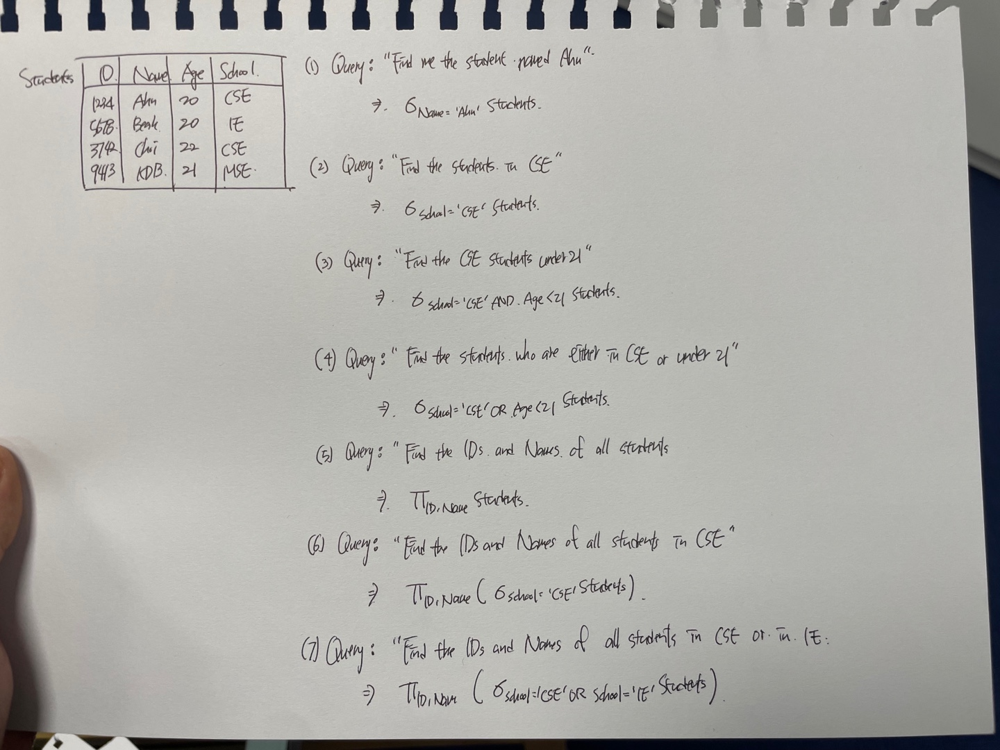
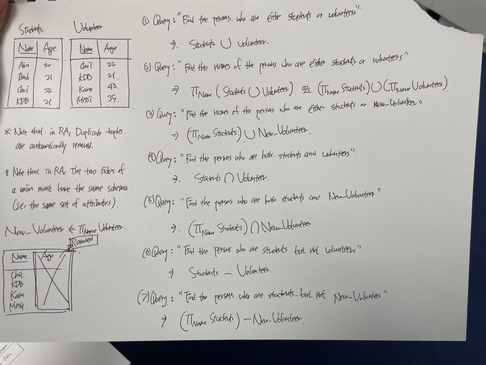
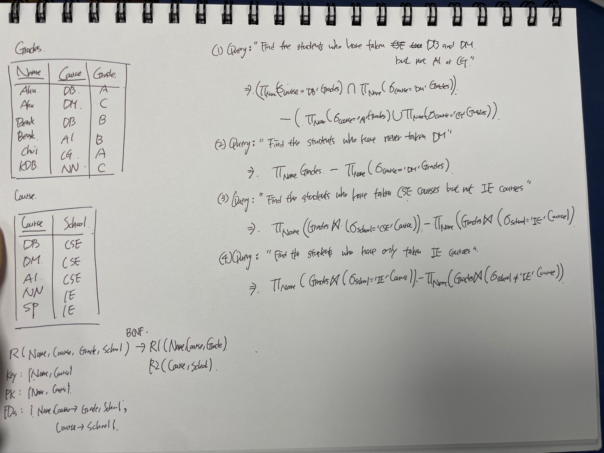
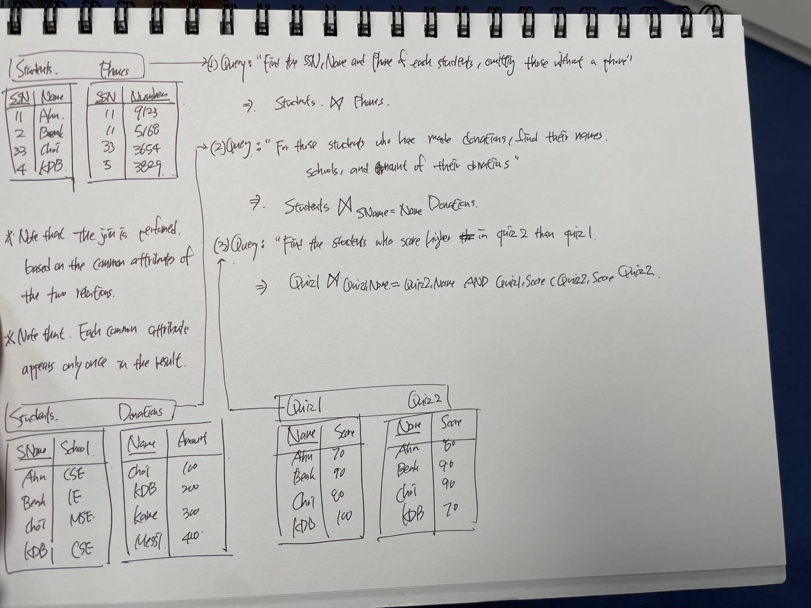
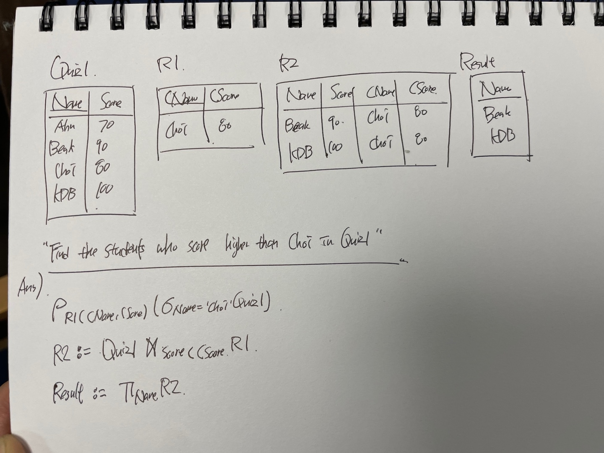
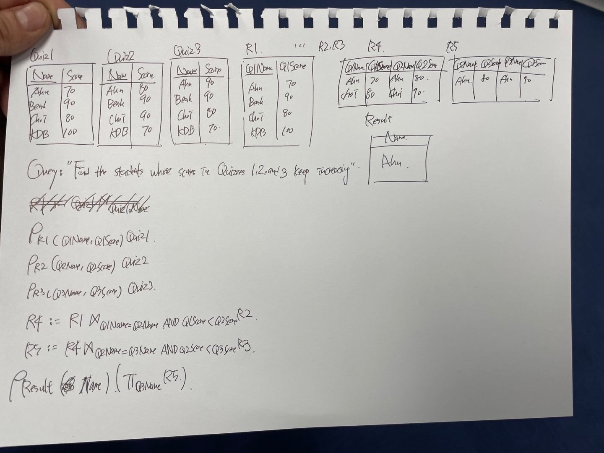

Relational Algebra에 관한 정리글

## Motivation

현재까지 해왔던 일
- 개념적 모델 → ER 다이어그램
- ER 다이어그램 → DB schema
- DB schema → Normalization (1NF, 2NF, 3NF, BCNF, ... )

 

만들어진 TABLE을 가지고 할 수 있는 일
- → Structured Query Language (SQL) : User Side
- → Relational Algebra (RA) : DB side

 

## Relational Algebra

사용하는 이유 ?
- 원하고자 하는 데이터를 쉽고, 빠르고, 정확하게 얻고자 사용한다
- 새로운 데이터 언어 제안 시, 해당 데이터 언어의 유용성을 검증하는 기준이다
- 관계 대수나 해석으로, 기술할 수 있는 모든 Query를 기술할 수 있으면 데이터 언어를 관계적으로 완전 (Relationally Complete)하다고 판단할 수 있다

 

Relational Algebra란 ?
- Relation을 다루는 연산으로, 검색 질의를 기술하는데 사용한다
- 절차식 언어이다 → User가 원하는 결과를 위해 어떤 연산을 수행해야 할 지 시스템이 알려준다

 

사용되는 연산자

1. Selection (σ)
2. Projection (π)
3. Union (∪)
4. Intersection (∩)
5. Difference (-)
6. Natural Join (⋈)
7. Theta Join ($⋈_{condition}$)
8. Cartesian Product ($\times$)
9. Assignment (:=)
10. Rename ($\rho$)

### Example

아직 한 문제를 풀지 못했는데, 다음 시간이 되기 전에 풀어봐야겠다:)      
RA를 보니 우리가 어떻게 DB를 사용하고 있었을까를 생각해보게 된 것 같다.     
DB는 배우면 배울수록 많이 사용할 수 있는 그런 과목이라고 생각이 들고,   
더 빡세게 공부해야겠다고 생각이 든다.   
심지어는 계절학기 때 공부하려고 하는 정보처리기사 자격증에도 DB파트가 있다고 한다.  
미래를 위해서라도 지금 확실하게 해야겠다.   
그리고 글로 써서 사진을 찍으려니 조금 더러워보여서 아이패드로 필기해야겠다 :(   
오늘의 DB 끝!