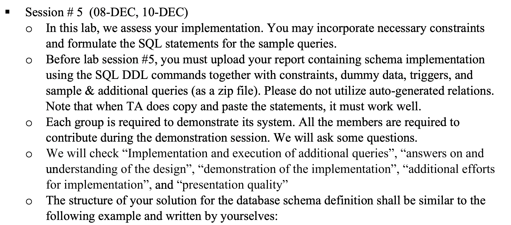

DB lab#5 정리글

## 과제 설명




<br/><br/>

## 내 생각

```
lab#3에서 만들었던 스키마를 직접 구현해보는 과제였다.   
처음에는 MySQL을 깔고, VSCODE에 연결하는 것까지 하는데도 오래걸렸다.    
하지만 한 번 연결한 후에는 그렇게 어렵지 않게 연동할 수 있었다.     
SQL 문법에 대해서도 다시 공부해볼 수 있는 좋은 경험이었다.
우리 조에서 나는 DDL을 만드는 파트였고, 그렇다보니 처음부터 코드를 짜볼 수 있었다.
그렇다보니 SQL문법도 공부하고, 다른 부분에 대해서도 많이 생각해볼 수 있었다.
특히, PK는 NOT NULL, FK는 PK 혹은 UNIQUE 속성, 다양한 CONSTRAINTS을 공부할 수 있었다.
TRIGGER을 보면서 우리가 실제로 사용하는 웹의 특성까지도 이해할 수 있었다.
역시 실제로 경험해보면서 공부하는 것이 가장 공부가 잘 되는 것 같다 :)
시간이 제법 많이 걸렸음에도 많은 것들을 배워볼 수 있는 계기가 되어서 너무 좋았다.
다만 조금 아쉬웠던 점은, 개별 과제로 주어졌다면 TRIGGER까지 모든 부분을 짜봤을텐데 그게 아쉬웠다.
지금 당장에는 시간이 부족해서 뒤의 부분을 짜지 못하지만 방학 때 DB를 공부하면서 해볼 계획이다 😁  
```

<br/><br/>

## 스키마

```
OUR SCHEMA

person1 (Person_ID, Name, Email, Address, Nation, Phone)
If Address is updated and updated address is not in person2, insert (updated address, NULL) to person2.

person2 (Address, PostalCode)

schools (Person_ID, Schools)
Person_ID references person1(Person_ID)

Stakeholders (Stakeholder_ID, Domain, Person_ID)

professor (Professor_ID, Major, Department_name, Person_ID)

staff (Staff_ID, Date_Hired, Position, Person_ID)

technical_staff (Staff_ID, Lab_Name, Department_Name)
Staff_ID references staff(Staff_ID)
If newly inserted staff was in administrative_staff, delete the information in administrative_staff.

administrative_staff (Staff_ID)
Staff_ID references staff(Staff_ID)
If newly inserted staff was in technical_staff, delete the information in administrative_staff.

administrative_manager (Staff_ID)
Staff_ID references administrative_staff(Staff_ID)

student (Student_ID, Year, Person_ID)

Majors (Student_ID, Majors)
Student_ID references student(Student_ID)

Minors (Student_ID, Minors)
Student_ID references student(Student_ID)

undergraduate (Student_ID)
Student_ID references student(Student_ID)

graduate (Student_ID, Professor_ID)
Student_ID references student(Student_ID)
If newly inserted student was in undergraduate, delete the information in undergraduate.

course (Course_ID, Name, Credit, Date_Time)

laboratory1 (Lab_Name, Department_Name, Capacity, Location)

laboratory2 (Department_Name, Department_Number)
Department_Name references laboratory1(Department_Name) on update cascade on delete cascade

teaching_laboratory (Lab_Name, Department_Name)
(Lab_Name, Department_Name) references laboratory1(Lab_Name, Department_Name) on update cascade on delete cascade

research_laboratory (Lab_Name, Department_Name)
(Lab_Name, Department_Name) references laboratory1(Lab_Name, Department_Name) on update cascade on delete cascade

equipment1 (Equipment_ID, Lab_Name, Department_Name, Model_No, Date_Purchased)
(Lab_Name, Department_Name) references laboratory1(Lab_Name, Department_Name) on update cascade on delete set null

equipment2 (Model_No, Name)

opinion (Stakeholder_ID, opinion_ID, topic, date, type)
Stakeholder_ID references Stakeholders(Stakeholder_ID)

take (Student_ID, Course_ID)
Student_ID references student(Student_ID)
Course_ID references course(Course_ID)

teach (Professor_ID, Course_ID)
Professor_ID references professor(Professor_ID)
Course_ID references course(Course_ID)

experiment (Student_ID, Lab_Name, Department_Name, Attendance_Date)
Student_ID references undergraduate(Student_ID)
(Lab_Name, Department_Name) references teaching_laboratory(Lab_Name, Department_Name) on update cascade on delete set null

assigned (Student_ID, Lab_Name, Department_Name, Topic)
Student_ID references graduate(Student_ID)
(Lab_Name, Department_Name) references research_laboratory(Lab_Name, Department_Name) on update cascade on delete set null

hire (Staff_ID, Professor_ID)
Staff_ID references administrative_manager(Staff_ID)
Professor_ID references professor(Professor_ID)
```


## 코드

코드가 궁금하다면, [해준's DB GIT](https://github.com/haejunejung/DB/tree/main/LAB)을 클릭하세요 ❗️